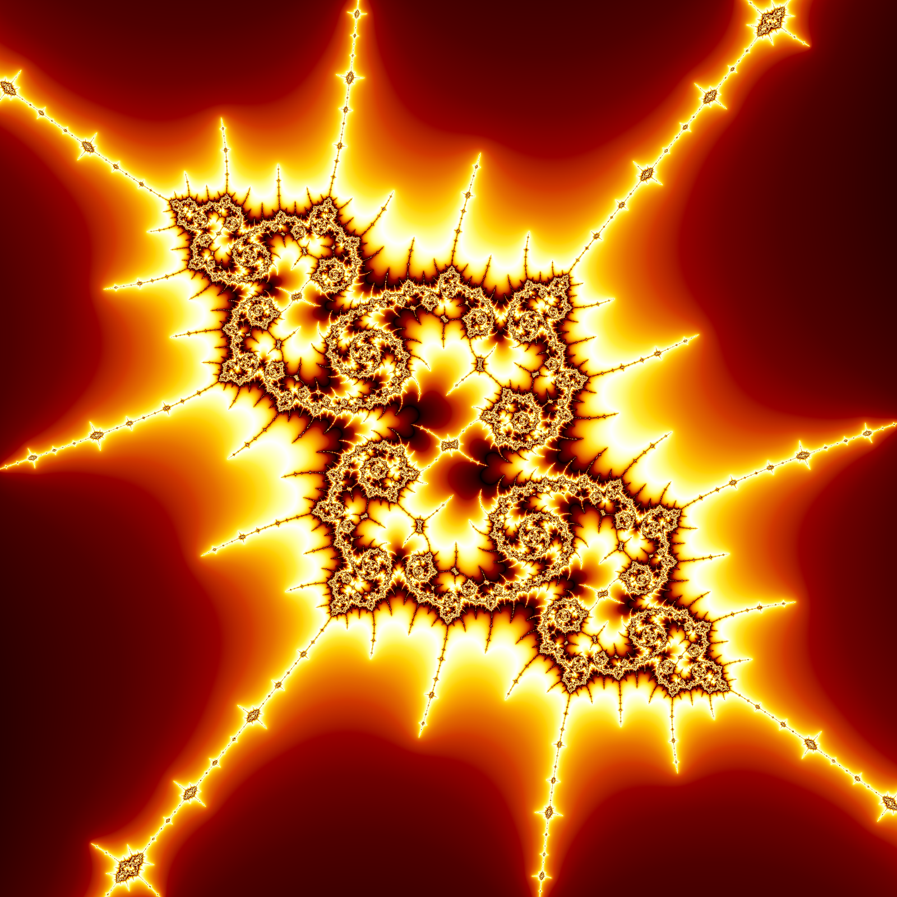

# Fract

Hardware accelerated viewer of the [Mandelbrot set](https://en.wikipedia.org/wiki/Mandelbrot_set#Computer_drawings).

Utilizes perturbation theory and weird floatexp hack to dramatically increase zoom depth. I highly recommend reading these blog posts to learn more:
- https://www.hgreer.com/JavascriptMandelbrot/
- https://philthompson.me/2022/Perturbation-Theory-and-the-Mandelbrot-set.html

## Quick Start

Run the viewer:
```console
$ cargo run --release -- -v
```

Render an image:
```console
$ cargo run --release -- path/to/output.png
```

Render a video:
```console
$ cargo run --release -- path/to/output.mp4 -f <frames-to-render>
```

Supply a toml config:
```console
$ cargo run --release -- -c path/to/config.toml -v
```

## Screenshot



```toml
x = "-1.769081456227405031584376710555741599567825506942627814698025962013971064256665544200937483455987842380495016067088453089587774963127205148411501408843683817070983395948004"
y = "0.0030377871525391196733948818194127406810237449464586603167438194620189205713414887877817696181264985645608949434059630663340344379280419433665926372040485459727575552576465"
zoom = "0.0000000000000000000000000000000000000000000000000000000000000000000000000000000000000000000000000000000000000000000000000000000000000000000000000000000000046614629568993871"
iterations = 30_000
width = 1600
height = 1600
palette = "lava"
ssaa = true
```
