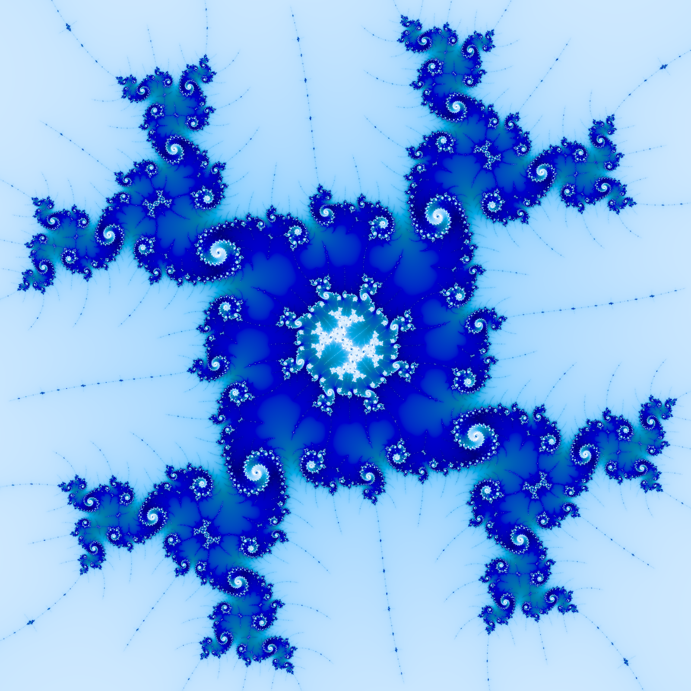
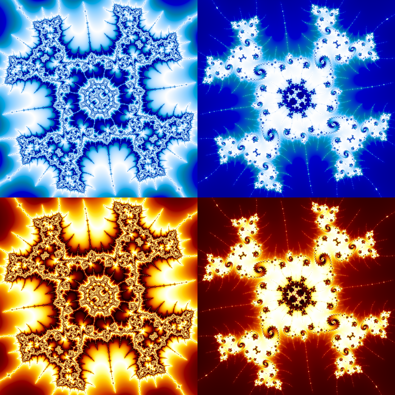

# Fract

Hardware accelerated viewer and renderer of the [Mandelbrot set](https://en.wikipedia.org/wiki/Mandelbrot_set#Computer_drawings).

Utilizes perturbation theory and floatexp hacks to dramatically increase zoom depth. I highly recommend reading these blog posts to learn more:
- https://www.hgreer.com/JavascriptMandelbrot/
- https://philthompson.me/2022/Perturbation-Theory-and-the-Mandelbrot-set.html

## Quick Start

Run the viewer:
```console
$ cargo run --release --bin viewer [-c path/to/config.toml]
```

Render an image:
```console
$ cargo run --release --bin render -- path/to/output.png [-c path/to/config.toml]
```

Render a video:
```console
$ cargo run --release --bin render -- path/to/output.mp4 -f <frames-to-render> [-c path/to/config.toml]
```

## Render



### config.toml
```toml
x = "-1.7690814562274050315843767105557415995678255069426278146980259620139710642566655442009374834559878423804950160670884530895877749631272051484115014088436838171018577431016064742982861363434485188915609110284713816209959873096271124445909401576038424768405556901626279793232591167500361830071405441228900464506822539695773892641468097196219543795396716763281369051688600836100771838749965617843836455988534142790906023944915887005"
y = "3.0377871525391196733948818194127406810237449464586603167438194620189205713414887877817696181264985645608949434059630663340344379280419433665926372040485460024532852083671664920462142886525154171890186346749351588107177959805732299487493122862351563328926797295024768631270863385453426654541458062970230601510206819445423675824191321178649755236003040767570927699493473340819305918471510965391785574541776595164476363364112055488177e-3"
zoom = "-3.45203859247563743596137253886957745944224781934541292862262693917803746729724445256145549430994377696636240274353309098493158843839476466008934497046716357170224025984718560232606489386367321033053359248258650241547902015318889733820470636989866527562378605562009781208580927208811968017194657489933853934172813883491724651759182900430176031831303973717053831930193610906159183393510768737918316412711827295106801836454752002011133544079524183036919449111115239357515513172689972858766208616617485905628414946626503593182199641839776547970545630502889169847522401590520271882683034838056336438232811258163227948262367820661394632729687882365133080405156084642542340563269242928857870289954325999593575421335654375526566576374105603682049049733959209401095717559972950131605044153676286466810869898063539275733874500848097683824458597e-421"
iterations = 1_000_000
palette = "ocean"

width = 1600
height = 1600

ssaa = true
batch_iter = 1000
color_scale = 250
```

## Permute



### permute.toml
```toml
palette = ["ocean", "lava"]
iterations = [100_000]
color_scale = [24.0, 150.0]
```

I generated a collage from the output images on macos with this script:
```sh
#!/bin/bash
set -e
cargo run --release --bin permute -- -c config.toml -p per.toml permutes \
	| grep -oE "permutes/[0-9]+/frames" \
	| xargs -I {} montage "{}"/*.png -tile x2 -geometry 400x400+0+0 $1
open $1
```
